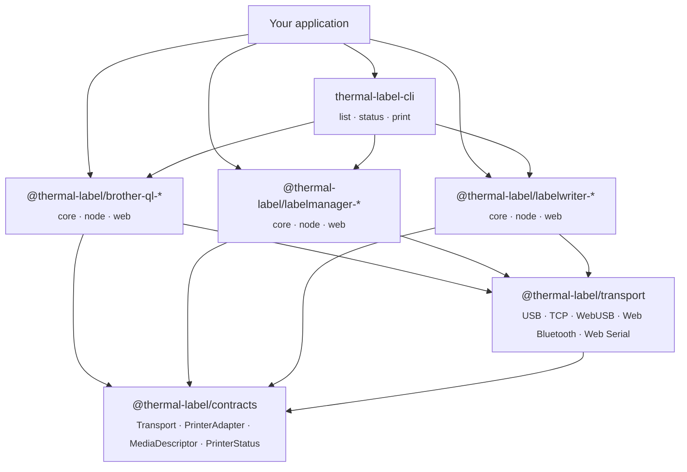

## thermal-label

**TypeScript printer drivers and plumbing** for people who want thermal labels inside real applications — not a throwaway script, not a proprietary SDK you cannot ship.

The stack is deliberately layered:

1. **`@thermal-label/contracts`** — shared **types only**: `Transport`, `PrinterAdapter`, `PrinterDiscovery`, media and status shapes, structured errors. One import surface for drivers and for apps that sit above them. Bitmap types line up with [`@mbtech-nl/bitmap`](https://github.com/mbtech-nl/bitmap) so rendered labels move cleanly from design tools into drivers.

2. **`@thermal-label/transport`** — **byte channels** that implement those contracts: **Node** `UsbTransport` / `TcpTransport` (libusb + JetDirect-style raw TCP), and **browser** `WebUsbTransport` / `WebBluetoothTransport` / `WebSerialTransport` with discovery helpers. Subpath exports keep native `usb` out of browser bundles.

3. **Device families** — each driver is published as **core + node + web** packages: **Brother QL**, **DYMO LabelWriter**, **DYMO LabelManager (D1 / WebHID)**. Same concepts everywhere: open or request a printer, query status and detected media, print or preview, close cleanly.

4. **`thermal-label-cli`** — one **minimal** command-line entry point that aggregates every **installed** driver for `list`, `status`, and quick `print text` / `print image` — ideal for CI, headless servers, and "does this USB cable actually work?" moments. Richer template, CSV, and sheet workflows live in the **burnmark** tooling, not here by design.

If you are **embedding** printers: start from contracts and transport, pick the driver packages you need, and wire `PrinterDiscovery` / `PrinterAdapter` into your app the same way in Node or in Chromium. If you are **shipping labels** at volume with barcodes and templates, pair these drivers with **[burnmark-io](https://github.com/burnmark-io)** — same ecosystem, different layer.

**Documentation:** [thermal-label.github.io](https://thermal-label.github.io) — full per-driver guides, hardware lists, API reference, live demos.

**Contributing:** see [`CONTRIBUTING/`](https://github.com/thermal-label/.github/tree/main/CONTRIBUTING) — code of conduct, security policy, "adding a driver" guide, release process, docs conventions all live in this `.github` repo.

**Explore:** [Organization website](https://thermal-label.github.io/) · [burnmark-io](https://github.com/burnmark-io) (design & production) · [mbtech-nl](https://github.com/mbtech-nl) (shared bitmap & configs)

**Repositories:** [contracts](https://github.com/thermal-label/contracts) · [transport](https://github.com/thermal-label/transport) · [brother-ql](https://github.com/thermal-label/brother-ql) · [labelwriter](https://github.com/thermal-label/labelwriter) · [labelmanager](https://github.com/thermal-label/labelmanager) · [cli](https://github.com/thermal-label/cli)

_Not affiliated with DYMO, Brother, or other manufacturers; trademarks belong to their owners._
