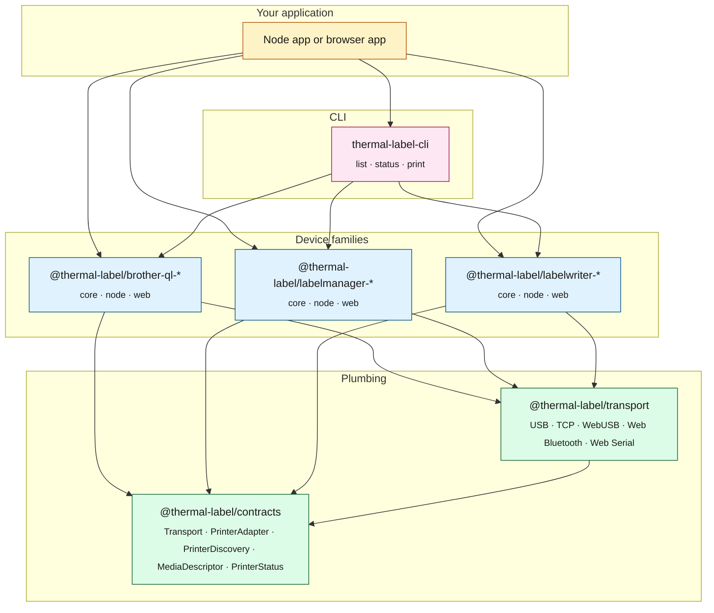

# Architecture diagram

The thermal-label stack, in dependency order. Arrows point from consumer to
producer (i.e. "depends on").

## How to read it

- **`@thermal-label/contracts`** at the bottom is types-only. Everything else
  imports from it; it imports nothing internal.
- **`@thermal-label/transport`** sits one level up and provides the byte
  channels. Drivers compose it; they don't reimplement USB/TCP/WebUSB.
- **Each driver** is published as `core` + `node` + `web` packages. `core` is
  pure protocol; `node` and `web` add the integration with a transport.
- **`thermal-label-cli`** auto-discovers any installed driver with a
  `discovery` named export. Adding a driver doesn't require a CLI change.
- **Your application** imports drivers directly (the typed API) or shells out
  to the CLI (for ops, CI, "is this cable working" moments).
